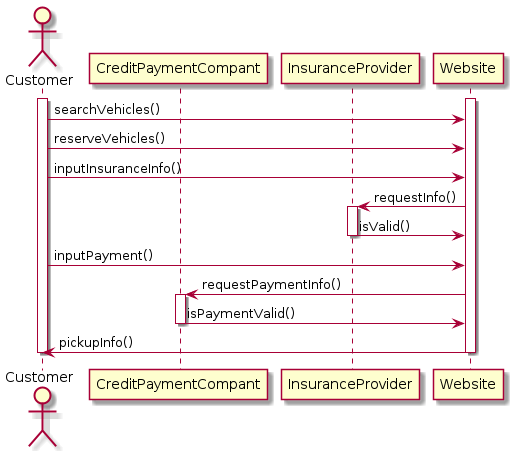

# Group Project Part II Notes

Alright so in a nutshell for group project part two we _each_ need to create
1. Two more use cases (filling out the table)
2. Two use case diagrams (pertaining to two of the use cases)
3. Two scenarios (short stories) pertaining to two the use cases
4. One sequence diagram pertaining to a use case

[Please see the notes on drawing diagrams](#Notes on diagrams)

There's also object diagram stuff but I need to clarify with M.C. Kianoosh some things first

A list of use case topics we can choose from; of course if you'd like feel free to write your heart out on some other topic

##### Independent use cases
* Changing database password 
  * not account entry password, password to entire database
* Modifying account details 
  * changing account entry after doing the Add account use case
* Copy username/password to _MobileDevice_ clipboard 
  * to be pasted into login fields within device
* Clear clipboard automatically
  * Clear the clipboard automatically for security reasons
* Create account entry group 
  * like a file folder except for account entries
* Add icons to entries/groups
  * maybe emojis or some other symbols
* Lock app 
  * is probably going to have several alternative flows i.e. lock on timeout, screen off
* Change settings
  * Edit, for example, how long until timeout or clearing clipboard
* Backup Database
  * Use some kind of API like webdav to backup the database
* Check database for password breach
  * Use some [third party service](https://haveibeenpwned.com/) to check whether or not a website has reported some kind of personal data breach 
  * Notify the _DeviceUser_
* Search database
  * A search field that would search by name or url for example

##### Use cases for refractoring (to be 'included' in existing use cases)
* Send to recycling bin
  * An alternative flow to _Remove Account_
* Select multiple accounts
  * [See this](https://material.io/design/interaction/selection.html#item-selection)


##### Completed Use Cases 
~~* Add account~~
~~* Generate Password~~
~~* Remove account~~
~~* Logging into app~~
~~* Pair Dongle~~

##### Notes on diagrams
When it comes to drawing the diagrams I'd recommend we look into [PlantUML](https://plantuml.com/starting), it would save me a bit of time/CPU cycles if you guys/gals would draw them using it. I find it really simplifies the whole process and of course makes things look fantastic. For example on our last assignment, our sequence diagram looked like this:



And the whole 'code' needed for it is

```
@startuml
actor Customer as Foo1
participant CreditPaymentCompant as Foo2
participant InsuranceProvider as Foo3
participant Website as Foo4
Activate Foo1
Activate Foo4
Foo1-> Foo4 : searchVehicles() 
Foo1 -> Foo4 : reserveVehicles() 
Foo1 -> Foo4 : inputInsuranceInfo() 
Foo4 -> Foo3 : requestInfo()
Activate Foo3
Foo3 -> Foo4 : isValid()
Deactivate Foo3
Foo1 -> Foo4 : inputPayment() 
Foo4 -> Foo2 : requestPaymentInfo()
Activate Foo2
Foo2 -> Foo4 : isPaymentValid()
Deactivate Foo2
Foo4 -> Foo1 : pickupInfo()
Deactivate Foo4
Deactivate Foo1
@enduml
```

So yeah super simple syntax, after writing it you just do `java -jar plantuml.jar sequenceDiagram.txt` or what have you to convert it into an image. Alright I'll stop shilling now.

